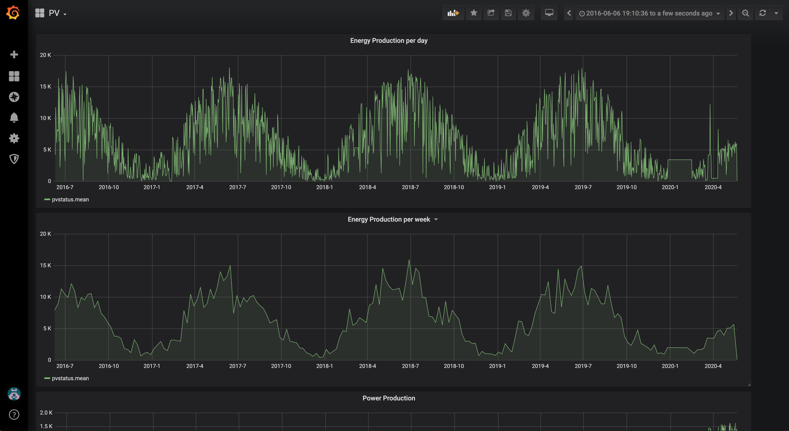

# RaspLogger

RaspLogger is a collection of datalogger modules that capture data and store them in an influxdb database

## modules

- destiny - clan details
- fitbit - collect health data from fitbit api
- lights - collect smart lighting info from philips hue
- parking - collect parking data from amsterdam parking api
- pv - collect solarpanel data from pvoutput.org
- router - collect router data from fritzbox
- temperature - collect outside temperature from a particle photon arduino sensor
- thermostat - collect temperature data from tado smart thermostat

## getting started

ensure an influxdb server is running
```
docker run -d -p 8086:8086 -v ~/influxdb/data:/var/lib/influxdb/data --restart always --name influxdb influxdb
```

run rasplogger through docker
```
docker run -it --rm --name rasplogger -v "$PWD":/usr/src/app -w /usr/src/app --restart always node:13-buster node rasplogger.js once destiny -u http://influxdb:8086/destiny
```

## usage

```
Usage: rasplogger [options] [command]

Options:
  -V, --version              output the version number
  -u, --url <url>            influx database url
  -h, --help                 display help for command

Commands:
  once <module>              run rasplogger once for a specific module
  cron <module> <frequency>  run rasplogger using cron for a specific module with a specific cron frequency string
  all                        run all rasplogger modules concurrently with predefined cron values
  help [command]             display help for command
```

## examples

log destiny data once
```
node rasplogger.js once parking -u http://localhost:8086/parking
```

log parking data every second
```
node rasplogger.js cron parking "* * * * * *" -u http://localhost:8086/parking
```

log pvdata every 5 minutes
```
node rasplogger.js cron pv "*/5 * * * *" -u http://localhost:8086/pv
```

log router data every 30 minutes
```
node rasplogger.js cron parking "*/30 * * * *" -u http://localhost:8086/parking
```

start all loggers through cron at the same time (-u is used to specify base influxdb string without databasename)
```
node rasplogger all -u http://localhost:8086
```

## grafana dashboards

you can use the following grafana dashboard exports to visualise the data collected by rasplogger


[PV Output dashboard json export for Grafana 6.7.3](grafana-dashboards/pv-output.json)
